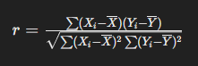
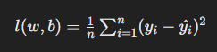
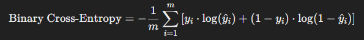

#### 배운 내용을 필요할 때 찾아볼 수 있게 가이드북 형태로 작성


#### Data 타입   
```python
  dtype = torch.int32 or torch.int 
  dtype = torch.float32 or torch.float
```

#### 기초 문법

```python
torch.min(), max() # min, max, sum, prod, mean, var, std 모두 지원
dim() # 차원
size(), shape() # 크기
x.numel() # Tensor에 있는 요소의 총 개수 확인
```

#### Tensor 생성

```python
torch.rand(n) # 특정 크기의 연속균등분포 난수
torch.randn_like(n) # n과 크기와 자료형이 같은 표준정규분포(평균이 0 표준편차가 1인 곡선) 난수
q = torch.empty(5) # 성능과 메모리 사용성의 이점있음
q.fill_(3.0) # inplace 방식
v = torch.from_numpy(u).float() # Numpy로 생성된 Tensor는 기본적으로 정수형
x = torch.IntTensor() # FloatTensor
y = x.clone() # Tensor 복제
z = x.detach() # clone 과 다른점: 계산그래프에서 분리하여 새로운 Tensor z에 저장
```

#### device

```python
a.device # 현재 디바이스
torch.cuda.is_avilable() # CUDA를 사용할 수 있는 환경인지 확인
torch.cuda.device_count() # 사용 가능한 GPU 개수
torch.cuda.get_device_name(device=0) # cuda device name 확인
torch.tensor().to(device='cuda') or torch.tensor().cuda()
```

#### indexing & slicing
```python
indexing : Tensor의 특정위치의 요소에 접근하는 것 

slicing : 부분집합을 선택해 새로운 Sub Tensor 생성하는 과정
```

#### Tensor 모양 변경

```python
연속적 메모리 할당의 이해
view() 와 reshape() 의 차이 이해
is_contiguous() # 메모리의 연속성 확인
flatten()  # 전처리를 위한 평탄화
transpose() # 특정 두 차원의 축을 뒤바꿈
squeeze() & unsqeeze() # 차원 축소 확장
stack() # Tensor들 간의 결합
```

#### Tensor 산술연산
```python
a.add_(b) # inplace 방식
torch.sub(f,e) # mul, pow,
torch.eq(v,w) # 결과는 Boolean Tensor로 출력 # ne, ge, lt, le
logical_and(a,b)  # 논리곱(and) 논리합(or) 배타적 논리합(XOR) 이해
```

#### 노름에대한 이해,활용 Tensor의 행렬곱
```python
# 1-D Tensor의 노름 이해
L1(맨해튼), L2(유클리드), L∞
torch.norm(a, p=2), norm(a, p=float('inf'))

# 맨해튼, 유클리드, 코사인 유사도
cosine_similarity = torch.dot(b,c) / (torch.norm(b, p=2)) * (torch.norm(c, p=2))

# 2-D Tensor 행렬 곱셈  A.matmul(B), A.mm(B), A @ B
행렬 곱을 응용한 대칭 이동 수행
```


## LinearRegression

> - 선형 회귀 모델에서 학습이란 y = wx + b 의 기울기(가중치) w와 y절편(바이어스) b 를 찾는 과정
> - 신경만 관점에서 선형 회귀 모델은 입력층의 특징 변수가 출력층의 예측 변수로 mapping 되는 과정

- #### 상관계수

> 두 변수 간의 선형 관계 분석 (표본상관계수)

```python
import numpy as np
np.corrcoef(x, t)
```



- #### nn.Module 

> nn.Module 은 일관성, 모듈화의 장점을 지님

```python
import torch.nn as nn 

class LinearRegressionModel(nn.Module): # 클래스 생성
model = LinearRegressionModel() # 인스턴스 생성 
```

> 매서드

```python
def __init__(self): # 생성자 매서드

super(LinearRegressionModel, self).__init__() # 부모 클래스 생성자 호출

self.linear = nn.Linear(1,1) # 클래스 속성 코드

def forward(self, x): # 순전파 매서드
	y = self.linear(x)
```


- #### 손실 함수 (loss function)

> MSE(Mean Squared Error)

```python
loss_function = nn.MSELoss()
```



#### 경사하강법

> 대규모 데이터셋의 경우 계산 비용이 매우 커짐

- 확률적 경사하강법 SGD

  > 각각의 데이터 포인트마다 오차 계산

- 미니배치 경사하강법

  > 각 데이터를 배치 단위로 묶음으로써 SGD보다 노이즈를 줄일 수 있음

```python
import torch.optim as optim
optimizer = optim.SGD(model.parameters(), lr=0.01) # 확률적 경사하강법 코드
optimizer.zero_grad() # 기울기 초기화 
loss.backward() # 현재 loss에 대한 기울기 계산
optimizer.step() # 역전파로 계산된 기울기로 가중치 업데이트
```


## Binary Classification

> 새로운 데이터를 사전에 정의된 두가지 범주 중 하나로 분류하는 모델

```python
class BinaryClassificationModel(nn.Module):
    def __init__(self):
        super(BinaryClassificationModel, self).__init__()
        self.layer = nn.Linear(1,1)
        self.sigmoid = nn.Sigmoid()

	def forward(self, x): 
    	z = self.layer(x) # 중간 출력 
	    y = self.Sigmoid(z) # 선형 계층의 출력을 이진 분류 확률로 변환함
	    return y
```

- 시그모이드 함수(Sigmoid function)

  > 입력 값을 0과 1사이의 값으로 변환하는 비선형 함수
  >
  > 시그모이드 함수의 결과는 0과 1사이의 값이므로 그 결과를 확률로 해석할 수 있음


- 이진 교차 엔트로피(Binary Cross Entropy, BCE)

  > 시그모이드 함수의 계산 값인 0과 1사이의 연속적인 값을 0 또는 1로 분류하기위해 사용하는 손실 함수
  >
  > - 조건부 확률은 사건A가 발생했을때 사건 B가 발상행 확률을 의미
  > - 최대 가능도 추정은 주어진 데이터에 대해 모수를 측정하는 방법론 or 절차를 의미

  

```
loss_function = nn.BCELoss()
```


#### 데이터 표준화

> 모델을 구축하기 전에 데이터를 전처리하여 손실 값을 줄일수 있음

```python
from sklearn.preprocessing import StandardScaler
scaler_x = StandardScaler() # 객체 생성
x_scaled = scaler_x.fit_transform(x.reshape(-1,1)) # 표준화를 위해 2차원 형태로 변경
```

> 데이터 분할

```python
from sklearn.model_selection import train_test_split
train_test_split(x, t, test_size = 0.2, random_state = 42)
```


#### Dataset & DataLoader 

```python
from torch.utils.data import DataLoader, TensorDataset
class CustomDataset(Dataset):
```

#### DataLoader

```python
train_dataset = CustomDataset(x_test, t_test)
DataLoader(train_dataset, batch_size= batch_size , shuffle = True) # 테스트 데이터는 shuffle을 False로
```


#### 모델을 평가하려면

```python
model.eval() # 모델을 평가 모드로 전환
with torch.no_grad(): # 해당 불록 내부의 모든 코드가 기울기 계산없이 실행되도록 설정하는 코드
```

> 이진 분류 모델평가

```python
predictions = model(x_test) # 예측값 계산
predictions_lables = (predictions > 0.5).float() # 예측값에 따라 1 또는 0으로 변환 (Boolean값).float()
predictions_lables = predictions_lables.numpy() # 넘파이 배열로 변환
predictions_lables.flatten() # 보기쉽게 1차원 배열로 변환
```

