## Backpropagation

- [역전파는 손실 함수](https://en.wikipedia.org/wiki/Loss_function) 에 대한 피드포워드 신경망의 [가중치 공간](https://en.wikipedia.org/wiki/Parameter_space) 에서 그래디언트를 계산합니다 .


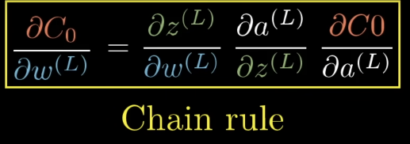

## 활성화 함수(activation function) 단점

1. ####  Sigmoid Functions: 기울기 소실문제(Vanishing Gradient)

   - sigmoid는 1과 0사이의 값으로 나오기 때문에 입력 값이 크거나 작을때 기울기가 0이 됨

     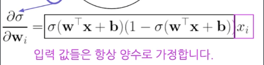

     

2. #### Not Zero-centered Output

- 입력 x가 모두 양수일때 sigmoid를 w(입력파라메터) 에 대해 미분했을때 항상 양수가 나옴.

- upstream gradient 의 부호에따라 모든 그레디언트들은 모두 양수이거나 모두 음수이다.

- gradient가 특정 방향으로(양수 or 음수)만 업데이트가 된다.

- exp() 계산이 어렵다

​	$ \frac{\partial \sigma (x)}{\partial x} = \sigma (x)(1 - \sigma(x)) $

### Tanh Functions 

- 특징 (Zero_centered)  , 출력 값의 범위 : [-1, 1]

- 여전히 기울기소실문제(Vanishing Gradient) 발생

- 커진 sigmoid 뉴런과 비슷함.


### ReLU (Rectified Linear Unit)

​	$ReLU(x) = max(0,x)$

> ##### 특징

+ 영역에서 saturate 되지 않음
+ 연산이 효율적임
+ sigmoid나 tanh 보다 발리 수렴함
+ 기울기 소실문제(Vanishing Gradient)가 없음

> ##### 단점

- 출력 값이 zero_centered 되지 않는다.
- Dead ReLU problem: 출력 값이 음수라면 saturated 되는 문제가 발생
- x = 0 일때 미분 불가능
- 음수 입력의 경우 기울기가 0이 되어, 해당 뉴런이 학습되지 않을 수 있습니다. 이를 "dying ReLU" 문제라고 합니다.

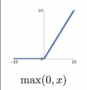

### Leaky ReLU

> ##### 특징

- ReLU와 같으나 No Dead ReLU 문제: 기울기 소실(Vanishing Gradient)이 되지 않는다


> ##### 단점

- 추가적인 하이퍼파라미터 (x가 0 미만일 때의 기울기)

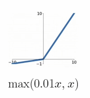

### ELU (Exponential Linear Unit)

> ##### 특징

- ReLU의 모든 장점

- (Leaky) ReLU에 비해 saturated된 음수 지역은 견고성을 더한다.

> ##### 단점

- exp() 의 연산이 비쌈 (Exponential  미분 복잡)

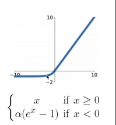

## Weight initialization

1. ### Small Gaussian Random

   ```python
   W = 0.01 * np.random.randn(d_in, d_out)
   x = np.tanh(x.dot(W))
   ```

   - For deeper network 에서 w의 값을 작은값으로하면 x ≈ 0 일 때, 모든 기울기가 0에 가까워져 학습이 되지 않음 (얕은 신경망에서는 좋은 결과를 냄)

     

2. ### Large Gaussian Rand

   ```python
   W = 0.5 * np.random.randn(d_in, d_out)
   x = np.tanh(x.dot(W))
   ```

   - For deeper network 에서 극단 값으로 밀려남

     

3. ### Xavier initialization

   $W \sim N\left(0,\frac{2}{n_{in}+n_{out}} \right)$


   - Sigmoid나 Tanh 활성화 함수를 사용할 때 적합하며, 입력과 출력의 노드 수를 고려하여 분산을 설정합니다.

   ```python
   W = np.random.randn(d_in, d_out) / np.sqrt(d_in + d_out)
   x = np.tanh(x.dot(W))
   ```

   - 모든 레이어들에 대해서 activation이 적당한 크기를 가짐

4. He Normal Initialization 

   $W \sim N\left(0,\frac{2}{n_{in}} \right)$

> 앞이 평균, 뒤가 분산

- ReLU는 양수일 때만 기울기가 살아 있기 때문에, '더 큰 분산'을 필요로 하며, 이는 뉴런의 활성화가 더 잘 발생하도록 돕습니다.


## Learning Rate Scheduling

- 매우 높은 학습률: loss가 급중할 수 있음
- 매우 낮은 학습률: loss는 줄어들지만 매우 천천히 움직임
- Learning Rate Decay : 처음에 큰 학습률을 사용하다 최적의 해에 접근하기 위해서 점점 작은 학습률을 사용함.
- Learning Rate Decay 같은 여러 기법과 경험을 통해 최적의 학습률을 찾는게 중요함

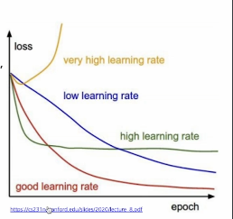

## Data Preprocessing

### Zero-centering & Normalization

```python
X -= np.mean(X, axis=0) # Zero-centering
X /= np.std(X, axis=0) # Normalization
```

### why zero_centering

- weight의 작은 변화에 덜 민감해집니다
- optimize하기 쉬워진다

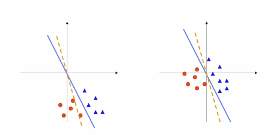

### PCA(Principal Component Analysis) 주성분 분석

- 고차원 데이터 집합이 주어졌을 때 원래의 고차원 데이터와 가장 비슷하면서 더 낮은 차원 데이터를 찾아내는 방법 (차원 축소 라고도 함)

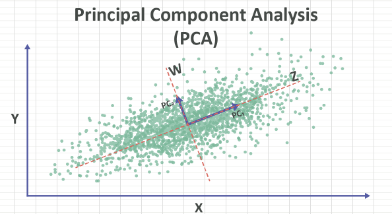

### Whitening

- 화이트닝 연산은 고유기저의 데이터를 가져와 모든 차원을 고유값으로 나누어 스케일을 정규화합니다.

- original data: 2차원 입력데이터

- decorrelated data: PCA를 수행한 후. 데이터는 0에 중심을 맞춘 다음 데이터 공분산 행렬의 고유 기저로 회전합니다. 이렇게 하면 데이터가 비상관화됩니다(공분산 행렬이 대각선이 됨).

- whitened data:  차원은 고유값에 의해 추가로 조정되어 데이터 공분산 행렬이 단위 행렬로 변환됩니다. 기하학적으로 이는 데이터를 등방성 가우스 블롭으로 늘리고 압축하는 것과 같습니다.

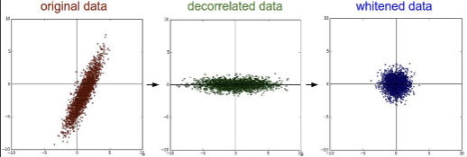

### Data Augmentation
- ML 모델은 초기 훈련 시에는 크고 다양한 데이터 세트를 필요로 하지만, 데이터 사일로, 관련 규정 및 기타 제한으로 인해 충분한 다양성을 갖춘 실제 데이터 세트를 소싱하기가 어려울 수 있습니다.
- 데이터 증강은 원본 데이터를 약간 변경하여 데이터 세트를 인위적으로 늘립니다.

### Why Data Augmentation
- 모델 성능 향상
- 데이터 의존성 감소
- 훈련 데이터의 과적합 완화
- 데이터 프라이버시 개선 (기존 데이터에 증강 기법을 적용하여 합성 데이터를 생성)

------


## RNN(Recurrent Neural Network)
- 시계열 데이터를 처리하기 위한 모델
- RNN은 은닉층의 노드에서 활성화 함수를 통해 나온 결과값을 출력층 방향으로도 보내면서, 다시 은닉층 노드의 다음 계산의 입력으로 보내는 특징을 갖고있습니다.

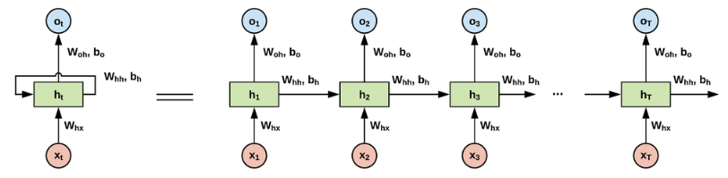

### RNN 장점
- 가변적인길이의 input sequence를 처리할 수 있음
- 입력이 많아져도 모델의 크기는 증가하지 않음
- 모든 단계에서의 동일한 가중치 사용

### RNN 단점
- 병렬화가 어려움 - 느림

- 기울기 폭발(exploding Gradient)

- 기울기 소실(Vanashing Gradient)

  > $\frac{\partial h_t }{\partial z_t} = \frac{\partial tanh(z_t) }{\partial z_t}= 1-tanh^2(z_t)=1-h^2_t$
  >
  > $\frac{\partial z_t }{\partial h_{t-1}} = W_{hh}$
  >
  > $\frac{\partial h_t }{\partial h_{t-1}}=\frac{\partial h_t}{\partial z_t}·\frac{\partial z_t}{\partial h_{t-1}}=(1-h^2_t)·W_{hh}$

  ​	
  
  
  
  
  
  
  
  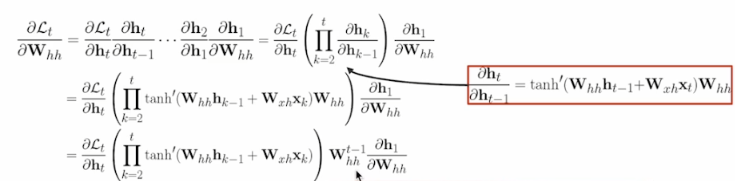

------

## LSTM

- Cell State

  정보가 전혀 바뀌지 않고 그대로만 흐르게 하는 부분

- Forget Gate

  이 Gate는 과거의 정보를 버릴지 말지 결정하는 과정입니다. 이 결정은 Sigmoid layer에 의해서 결정이 됩니다. 

- Input Gate

   Input Gate는 현재 정보를 기억하기 위한 게이트 입니다. 현재의 Cell state 값에 얼마나 더할지 말지를 정하는 역할

- Update

  과거 Cell State를 새로운 State로 업데이트 하는 과정입니다.

- Output Gate

  어떤 출력값을 출력할지 결정하는 과정으로 최종적으로 얻어진 Cell State 값을 얼마나 빼낼지 결정하는 역할


## GRU

- LSTM에서 은닉 상태를 업데이트하는 계산을 줄임. 업데이트, 리셋 게이트만 존재

## Atention

​	`Attention(Q, K, V) = Attention Value`

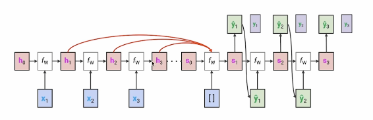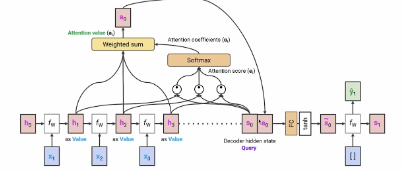

> $input_{sequence} = x_1,x_2,x_3,...,(x_n)$  ,  $h_i = W_h·x_i$
>
>  $Q_i = W_Q·h_i$  ,  $K_i = W_k·h_i$  ,   $V_i = W_v·h_i$
>
> $score_{1i} = Q_1K_i$
>
> $\alpha_{1i} = Softmax(score_{1i})$
>
> $z_1 = \sum \alpha_{1i} V_i$
>
> $output = W_o·z_1$


------


## Transformers


- ##### 포지셔널 인코딩(Positional Encoding)

> 트랜스포머는 단어의 위치 정보를 얻기 위해서 각 단어의 임베딩 벡터에 위치 정보들을 더하여 모델의 입력으로 사용하는데, 이를 포지셔널 인코딩(positional encoding)이라고 합니다.


> 트랜스포머는 사인 함수와 코사인 함수의 값을 임베딩 벡터에 더해주므로서 단어의 순서 정보를 더하여 줍니다.

​	$PE_{(pos, 2i)} = sin(pos/10000^{2i/d_{model}})$
​	$PE_{(pos, 2i+1)} = cos(pos/10000^{2i/d_{model}})$


​	임베딩 벡터 내의 각 차원의 인덱스가 짝수인 경우에는 사인 함수의 값을 사용하고 홀수인 경우에는 코사인 함수의 	값을 사용합니다.


- ##### Self-Attention

> Linear Layer
>
> Attention Score
>
> Scaling & Softmax


​		$Attention(Q,K,V) = softmax \left(\frac{Q⋅K^T}{\sqrt{d_k}} \right)V$

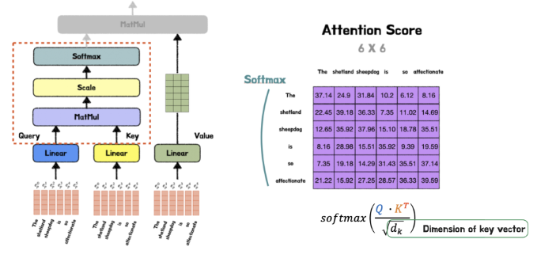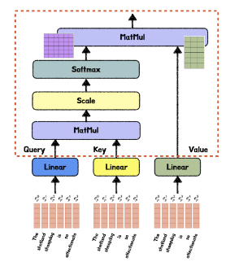


​	**(Attention)**: 일반적인 어텐션 메커니즘은 두 개의 다른 시퀀스 사이의 연관성을 계산함.

​	**(Self-Attention)**: 셀프 어텐션은 **동일한 시퀀스 내**에서 각 요소가 **다른 모든 요소들**과의 연관성을 계산함.

- 멀티 헤드 어텐션(Multi-head Attention)

  Self-Attention 을 병렬로 h번 학습하는 구조

  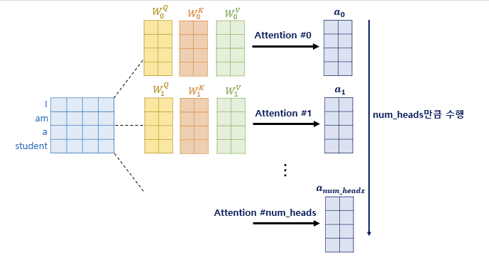


- ##### 잔차 연결(Residual connection) 	

​	$H(x) = x + Multi　head　Attention(x)$

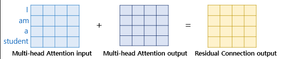

- ##### Layer Normalization

​	$LN = LayerNorm(x+Sublayer(x))$

​	층 정규화는 **텐서의 마지막 차원**에 대해서 평균과 분산을 구하고, 이를 가지고 어떤 수식을 통해 값을 정규화하여 학	습을 돕습니다. 


​	 층 정규화를 위해서 우선,화살표 방향으로 각각 평균 μ과 분산 σ2을 구해야 한다.

​			$ln_i = LayerNorm(x_i)$


