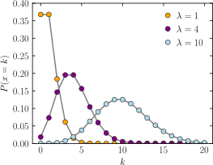

## 중심 극한 정리(Central Limit Theorem, CLT)

중심극한정리는 독립적인 확률 변수들의 합 또는 평균이 표본의 크기가 커질수록 정규 분포에 근사하는 현상을 설명합니다.
## 1. Uniform Distribution (균등분포)

**정의**: 균등분포는 주어진 구간 내에서 모든 값이 동일한 확률로 발생하는 분포입니다. 즉, 구간 내의 어떤 값이 나올 확률이 모두 동일합니다.

**확률 밀도 함수 (PDF)**: 균등분포의 확률 밀도 함수는 특정 구간 내에서 일정한 값을 가지며, 구간 밖에서는 0입니다.

**특징**: 데이터가 특정 구간 내에 고르게 분포되어 있으며, 평균과 중간값이 동일합니다.

## 2. Normal Distribution (정규분포) / Gaussian Distribution(가우시안 분포)

**정의**: 정규분포는 데이터가 평균을 중심으로 대칭적으로 분포하며, 대부분의 데이터가 평균 근처에 몰려 있는 분포입니다. 종 모양의 곡선으로 나타나는 것이 특징입니다.

**확률 밀도 함수 (PDF)**: 정규분포의 확률 밀도 함수는 평균 μ와 표준편차 σ에 따라 달라지며, 수학적으로는 다음과 같이 표현됩니다.

**특징 **

- 평균, 중앙값, 최빈값이 모두 동일합니다.

- 표준편차가 작을수록 그래프는 더 좁고 높아지며, 표준편차가 클수록 그래프는 더 넓고 낮아집니다.

- 정규분포는 자연 현상에서 많이 나타나는 분포로, 많은 통계적 방법이 정규분포를 기반으로 합니다.

  

## 3. Bernoulli Distribution(베르누이분포)

$p(n) = \begin{Bmatrix} 1-p \quad for\;n = 0\\p \quad for\;n = 1 \\\end{Bmatrix}$

베르누이 분포는 이산 확률 분포로, 단일 시도에서 성공 또는 실패(즉, 1 또는 0)라는 두 가지 결과 중 하나만 나타나는 경우를 모델링합니다.

## 4. 베타 분포(Beta Distribution)

베타 분포(Beta Distribution)는 연속 확률 분포로, 주로 0과 1 사이에 있는 확률 변수를 모델링하는 데 사용됩니다. B(α,β)

**Likelihood (우도)**: 주어진 데이터가 있을 때, 특정 파라미터 값에서 그 데이터가 얼마나 잘 설명되는지를 나타내는 함수입니다. 쉽게 말해, 특정 파라미터 값이 주어졌을 때 데이터가 관찰될 확률을 의미합니다.

**Maximum Likelihood Estimation (MLE, 최대우도추정)**: Likelihood를 최대화하는, 즉 주어진 데이터를 가장 잘 설명할 수 있는 최적의 파라미터 값을 찾는 방법입니다.

**Posterior** : Posterior는 **Prior(사전 확률)**에 **Likelihood(우도)**를 곱한 다음 이를 정규화(normalize)한 것입니다.

**디리클레 분포(Dirichlet distribution)** :여러 개의 확률 변수의 분포를 모델링할 때 유용합니다.
베타 분포의 다차원 확장이라고 생각할 수 있습니다.

## 5. Poisson Distribution (포아송분포)

> ###### By Skbkekas - 자작, CC BY 3.0, https://commons.wikimedia.org/w/index.php?curid=9447142

포아송 분포는 **람다(λ)**라는 단 하나의 파라미터로 정의되며, 이 값에 따라 특정 시간 간격이나 공간에서 독립적인 사건이 정확히 k번 발생할 확률을 계산하는 데 사용됩니다. 이 분포는 사건이 드물게 발생하는 상황에서 특히 유용합니다.

- 지수 분포는 포아송 과정에서 각 사건 사이의 대기 시간을 모델링하는 데 사용됩니다.
- 감마 분포는 여러 사건이 발생할 때까지의 총 대기 시간을 모델링하는 데 사용됩니다.

------

## VAE (Variational Autoencoder)
VAE는 데이터의 잠재 공간을 모델링하고 새로운 데이터를 생성할 수 있는 강력한 생성 모델입니다. 인코더와 디코더의 신경망 구조를 사용하여 데이터의 복잡한 분포를 학습하며, 리파라미터화 트릭을 통해 효율적인 학습을 가능하게 합니다. VAE는 이미지 생성, 텍스트 생성 등 다양한 분야에서 유용하게 활용됩니다.

- Autoencoder

- VAE

### 차원 축소 및 잠재 공간으로의 매핑

1. **잠재 공간으로의 매핑**: VAE의 인코더 네트워크는 입력 데이터를 잠재 공간(latent space)으로 매핑합니다. 이 과정에서 데이터의 차원을 줄여서 잠재 변수 z를 생성합니다. 이 잠재 공간은 원래 데이터 공간의 압축된 표현으로, 데이터의 중요한 특징을 담고 있습니다.

    - **차원 축소**: 인코더가 입력 데이터를 잠재 변수 z로 변환하면서 원래의 고차원 데이터를 저차원 잠재 공간으로 압축합니다.

    - **특징 파악**: 잠재 공간에서의 데이터는 데이터의 주요 특징을 반영하며, 이를 통해 데이터 분석과 시각화가 용이해집니다. 잠재 변수들은 데이터의 중요한 특성을 포착하고, 데이터의 구조를 이해하는 데 도움을 줍니다.
    
      

### 데이터의 재구성 및 생성

- **데이터의 재구성**: VAE의 디코더 네트워크는 잠재 변수 z를 입력받아 원래 데이터와 같은 형태로 재구성합니다. 즉, 디코더는 잠재 공간에서의 샘플을 바탕으로 입력 데이터의 근사치를 생성합니다. 이 과정은 데이터의 복원(reconstruction)을 목표로 하며, 원본 데이터와 유사한 데이터를 생성하려고 합니다.
- **연속적인 잠재 공간**: VAE의 잠재 공간은 연속적이며, 이를 통해 새로운 샘플을 부드럽고 자연스럽게 생성할 수 있습니다. 이는 잠재 공간의 점들 사이의 연속성을 활용하여 다양한 데이터 샘플을 생성할 수 있음을 의미합니다.
- **새로운 데이터 생성**: 학습이 완료된 후, VAE는 잠재 공간에서 새로운 점들을 샘플링하여 새로운 데이터를 생성할 수 있습니다. 이 때, 새로운 데이터는 잠재 공간에서 샘플링된 잠재 변수 z를 디코더에 입력하여 생성됩니다. 이 과정은 데이터 생성(generation)을 목적으로 하며, 기존 데이터의 패턴을 기반으로 새로운 샘플을 만들어냅니다.

### VAE 목적식

- **재구성 손실** (Reconstruction Loss): 원본 데이터와 디코더가 생성한 데이터 간의 차이를 측정합니다. 보통 교차 엔트로피(cross-entropy) 또는 평균 제곱 오차(MSE)를 사용합니다.

- **쿨백-라이블러 발산** (KL Divergence): 잠재 변수의 분포와 표준 정규 분포 간의 차이를 측정합니다. 이를 통해 잠재 공간이 표준 정규 분포에 가깝도록 유도합니다.

### 손실함수(Loss Function) 

$$Loss = Reconstruction \;Loss + KL \; Divergence$$

VAE는 단순히 데이터를 복원하는 것이 아니라, 새로운 데이터 생성과 입력 데이터의 복원이라는 두 가지 목표를 동시에 달성하는 모델입니다.

------

## 변분추론(Variational Inference)

Variational inference는 확률론적 모델에서 복잡한 분포의 근사값을 구하는 데 사용되는 방법입니다. 주로 Bayesian inference에서 사용되며, 복잡한 후방 확률 분포를 직접 계산하기 어려울 때 이를 간단한 분포로 근사하여 계산을 수행합니다.

### 주요 개념

1. **목표**: Variational inference의 목표는 실제 복잡한 분포 p(z∣x)를 근사 분포 q(z)로 대체하여 계산을 단순화하는 것입니다. 여기서 z는 잠재 변수, x는 관측 데이터입니다.

2. **ELBO** (Evidence Lower Bound): Variational inference는 ELBO를 최대화하여 근사 분포 q(z)를 최적화합니다.

3. **KL 다이버전스**: 근사 분포 q(z)와 실제 분포 p(z∣x) 사이의 차이를 측정하는 방법으로, KL 다이버전스가 사용됩니다. ELBO를 최대화하는 것은 이 KL 다이버전스를 최소화하는 것과 동일합니다.

4. **근사 분포 선택**: 근사 분포 q(z)는 일반적으로 계산이 용이한 형태로 선택됩니다. 가장 흔한 방법은 q(z)를 독립적인 Gaussian 분포로 설정하는 것입니다.

결과적으로, **근사 분포 q(z)**를 실제 후방 분포(**posteriors**)에 가깝게 만들어서 후방 분포의 근사값으로 사용하는 것이 Variational Inference의 목표입니다.

여기서 KL 다이버전스는 항상 0 이상이므로, ELBO는 log p(x)의 하한입니다. 

ELBO를 최대화하면 KL 다이버전스를 최소화하여 q(z)가 p(z∣x)에 가까워지게 됩니다.

## Mean-Field Variational Inference(MFVI)

- **Mean-Field 가정**

  Mean-Field 가정에서는 잠재 변수들 사이의 독립성을 가정합니다. 즉, 잠재 변수들이 서로 독립적이라고 가정하여 결합 분포를 근사할 때, 각 잠재 변수의 분포를 개별적으로 모델링합니다. 이 가정에 따라 근사 분포는 다음과 같이 분해됩니다:

MFVI는 **Variational Inference**의 기본적인 방법으로, 잠재 변수 간의 독립성을 가정함으로써 계산을 단순화하지만, 실제 후방 분포가 복잡할 경우 근사 오차가 클 수 있음을 염두에 두어야 합니다.

## EM(Expectation-Maximization)

EM(Expectation-Maximization) 알고리즘은 통계학과 머신러닝에서 널리 사용되는 반복적 방법으로, 관측된 데이터에 숨겨진(latent) 변수가 있을 때 최대우도 추정(MLE, Maximum Likelihood Estimation)을 수행하는 데 사용됩니다. 이 알고리즘은 데이터가 불완전하거나 일부 정보가 숨겨져 있을 때 파라미터를 추정하는 데 매우 효과적입니다.

### **EM 알고리즘의 주요 단계**

EM 알고리즘은 두 가지 주요 단계, **Expectation Step (E-step)**과 **Maximization Step (M-step)**을 반복하면서 파라미터를 점점 더 좋은 값으로 업데이트해 나갑니다.

1. **E-step (Expectation Step, 기대 단계)**:

   - 현재 추정된 파라미터 값을 사용하여 숨겨진 변수의 기대값을 계산합니다.

   - 이 단계는 실제로 숨겨진 변수를 추정하고, 그 값을 바탕으로 전체 데이터의 우도를 계산하는 단계입니다.

2. **M-step (Maximization Step, 최대화 단계)**:

   - E-step에서 계산된 기대값을 사용하여 파라미터를 다시 추정하고, 최대 우도를 가지는 파라미터 값을 찾습니다.

   - 이 단계는 우도를 최대화하여 파라미터를 업데이트합니다.

3. **반복**:

   - E-step과 M-step을 반복합니다. 각 반복에서 파라미터는 점진적으로 개선되며, 수렴할 때까지 계속됩니다. 일반적으로 우도가 더 이상 증가하지 않거나 변화량이 미미할 때까지 반복합니다.

     

     

### GMM (Gaussian Mixture Model)

GMM은 연속 데이터를 클러스터링할 때 사용되며, 데이터가 여러 개의 가우시안(정규) 분포의 혼합으로 이루어졌다고 가정합니다.

**EM 알고리즘의 역할:** EM은 각 데이터 포인트가 어떤 가우시안 분포에 속하는지에 대한 확률을 계산(E-step)하고, 이 확률을 사용해 가우시안 분포의 파라미터(평균, 분산, 혼합 계수 등)를 최적화(M-step)하는 과정을 반복합니다.

EM 알고리즘에서 가우시안 분포를 사용하면 GMM로 확장된다고 생각해도 됩니다.
