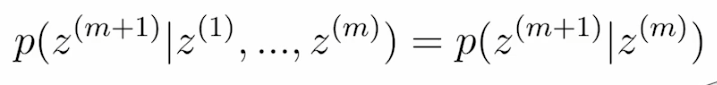
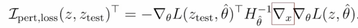
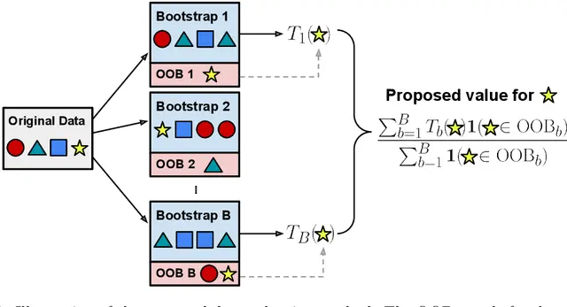
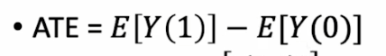
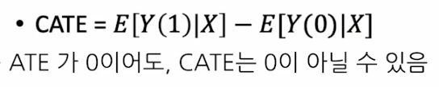
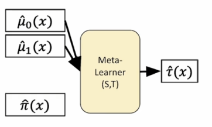

# Markov Chain Monte Carlo (MCMC)

------

## MCMC의 핵심 개념
MCMC의 목표는 복잡한 확률 분포에서 무작위 표본을 생성하여 해당 분포를 근사적으로 추정하는 것입니다. 이를 위해 MCMC는 Markov Chain을 사용하여 분포 내에서 이동하며, Monte Carlo 방법으로 샘플을 생성합니다.

1. **Markov Chain**
  Markov Chain은 현재 상태에서 다음 상태로 이동할 때, 이전 상태의 영향을 받지 않는 메모리리스(memoryless) 속성을 가진 확률 과정입니다.
  즉, 다음 상태는 현재 상태에만 의존하며, 이전 상태들에는 의존하지 않습니다. 이를 “Markov Property”라고 합니다.

  

2. **Monte Carlo**
  Monte Carlo 방법은 무작위 표본 추출을 사용하여 확률 분포의 특성을 근사적으로 계산하는 방법입니다.

## MCMC의 작동원리

1. MCMC의 작동 원리
목표 분포 설정: 추출하고자 하는 목표 확률 분포(예: 후방 분포)를 정의합니다. 이 분포는 직접 샘플링이 어렵기 때문에 MCMC를 사용합니다.

2. 초기 상태 설정: Markov Chain의 초기 상태를 설정합니다. 이 초기 상태는 임의로 설정할 수 있습니다.

3. 전이 규칙(Transition Rule): 다음 상태로 이동하기 위한 전이 규칙을 설정합니다. 이 규칙에 따라 현재 상태에서 다음 상태로 이동하게 됩니다.

4. 샘플 생성: Markov Chain을 여러 번 반복하여 새로운 샘플을 생성합니다. 충분히 많은 반복 후에는 생성된 샘플들이 목표 분포를 따르게 됩니다.

5. 수렴 확인: 충분히 반복하여 샘플들이 목표 분포에 수렴하면, 이 샘플들을 사용하여 원하는 통계적 추정을 수행합니다.

# 데이터의 가치측정 및 해석

------

## Influence Function

Influence Function을 활용할 경우, 모델을 재학습하지 않아도, 특정 data가 추가 및 제거 되었을 때를 고려한 model parameter 변화, loss 변화, 예측치 변화등을 근사할 수 있음.

데이터의 가치평가가 무엇이고 어느분야에 활용되는지 그러한 influence function 을 기반으로 해서 데이터 가치평가를 어떻게 할 수 있는지 에 대해 살펴봄

## Data-OOB Motivation

- Train 데이터셋에서 중복 가능한 조합 생성: 이 부분은 여러 부트스트랩 샘플을 생성하는 과정과 유사합니다. 데이터를 무작위로 샘플링하여 새로운 조합을 만드는 과정입니다.

- OOB 데이터 사용: 각 부트스트랩 샘플을 통해 학습된 모델은 해당 부트스트랩 샘플에 포함되지 않은 OOB 데이터를 평가하는 데 사용됩니다. 이를 통해 모델이 보지 못한 데이터에 대한 성능을 측정할 수 있습니다.

- 각 데이터의 가치 측정: OOB 손실(loss)을 계산함으로써, 개별 데이터 포인트가 모델 성능에 미치는 영향을 평가할 수 있습니다. 이를 통해 데이터 포인트가 모델의 예측 성능에 얼마나 기여하는지에 대한 가치를 정량적으로 측정할 수 있습니다.

즉 DVRL과는 다르게 validation dataset이 필요없다.

# 인과성 과 기계학습

------

## Average Treatment Effect (ATE)

## Conditional ATE (HTE or ITE) 

## Meta Learner

#####  (예: T-Learner, S-Learner, X-Learner 등)

Meta learner는 서로 다른 트리트먼트 효과를 추정하기 위해 각각의 트리트먼트 그룹에 대해 모델을 학습시킵니다.
예를 들어 트리트먼트가 두 가지일 때, 각 트리트먼트에 대해 별도의 예측 함수 $\hat{u}_0,\; \hat{u}_1$
 를 학습합니다.
그런 다음, 두 예측 함수의 차이를 계산하여 개별화된 트리트먼트 효과(ITE)를 추정합니다.

- S-Learner and T-Learner

  ​	$\hat{u}_1(x) - \hat{u}_0(x)$

## Two-Step Learner

Two-step learner는 먼저 사용자가 특정 트리트먼트를 선택할 확률을 예측하는 
𝜋(𝑥)를 추정합니다. 이 확률은 트리트먼트 할당의 편향을 조정하는 데 사용됩니다.
이후 $\hat{u}_0$과 $\hat{u}_1$를 각각 학습하는 과정이 이어지며, 이 두 모델의 예측 결과를 기반으로 새로운 레이블 $\tilde{y}$ 를 만듭니다.이 $\tilde{y}$ 는 보정된 예측 값으로, 예측된 트리트먼트 할당 확률과 실제 관측된 결과를 결합한 형태입니다.
마지막으로, 이 $\tilde{y}$를 학습시켜 최종적인 트리트먼트 효과 예측을 개선합니다.

### Meta Learner (Model-agnostic)

- S-Learner
- T-Learner
- RA-Learner
- PW-Learner
- DR-Learner (RA-Learner + PW-Learner)
