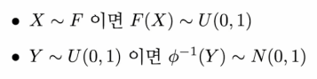

## 1. EDA

- 단변량 분석 : 대표값, 히스토그램, 막대, 파이차트 등
- 다변량 분석 : 상관관계, 산점도, 바이올린 플랏 등

------

## 2. Feature engineering

##### 예측 성능 측면

- 변수가 목표 변수와 강한 상관관계를 가지냐
- 모델이 학습할 충분한 정보를 제공하는지

##### 인사이트 도출 측면

- 변수의 의미가 해석 가능하냐
- 변수가 데이터의 본질적인 특성을 잘 나타내냐

##### SHAP value

- 다른변수를 고정하고 특정피쳐를 조정했을때 예측값이 주는 차이를 계산가능하면 변수의 중요성을 파악할 수 있음,

##### Permutation importance

- 모델에 변수(특정 한 피쳐)를 랜덤하게 섞어서 성능이 얼마나 하락했는지로 변수의 중요성을 파악하는 방법론

------

## 3. 데이터 전처리

### 3-1. 스케일링

데이터의 범위를 조정하는 기법

##### Standardization

- 데이터의 평균을 0, 표준편차를 1로 변환하는 방법

##### Normalization

- 데이터의 범위를 0과 1사이로 만드는 방법

### 3-2. 트랜스폼

데이터의 분포를 조정하는 기법

##### Log transform

- 로그 함수를 적용하여 양수인 데이터 분포를 정규화하는 방법

##### Box-Cox transform

- log transform 보다 더 일반적인 방법이며 데이터의 정규성을 개선하기위해 사용
- lambda는 변환의 강도와 형태를 결정하는 parameter로 가장 정규분포와 비슷하게 변환되는 값으로 선택됨

##### Power transform

- 데이터의 정규성 확보를 위한 방법으로 변수의 단위를 보존하기 위한 방법
- Box-Cox transform에 기하평균 개념 도입

##### Quantile transform

- 데이터를 두가지 통계적 정리를 이용하여 정규분포로 변환하는 방법

### 3-3. 인코딩

-  범주형 데이터를 수치형 데이터로 변환하여 처리

#### One-Hot Encoding

- 각 범주를 별도의 이진 변수 0과 1로 변환하여 표현
- 인코딩된 범주 벡터는 서로 독립적이다. (내적했을때 0)

