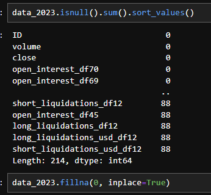

첫 프로젝트는 비트코인 시계열데이터 예측이었다.

주어진 데이터는 2011년~2023년까지의 마켓/네트워크 데이터가 있고 주어진 train(target)은 0 1 2 3 으로 종가 등락폭에의해 분류된 23년 데이터였고 목표는 24년 상반기 비트코인 종가 예측이다.

문제는 23년에만 target 과 close(종가), volume(거래량) 데이터가 있다는 것이었는데 이걸 해결하기위해 한 번의 트라이에서 세웠던 가설은 23년에는 target과 close,volume 이 있으니 23년 데이터로 close, volume을 학습해서 18~22년 데이터에서 close(target), volume 을 예측해서 피처로 사용하는 계획을 세웠다.

 

```python
# ID 열을 datetime 형식으로 변환
final_df['ID'] = pd.to_datetime(final_df['ID'], errors='coerce')
# 3. 훈련 데이터 (2018년 ~ 2022년)
data_18_to_22 = final_df[(final_df['ID'].dt.year >= 2018) & (final_df['ID'].dt.year <= 2022)] 
# 4. 훈련 데이터 (2023년)
data_2023 = final_df[final_df['ID'].dt.year == 2023]
# 5. 2024년 데이터
data_2024 = final_df[final_df['ID'].dt.year == 2024]
print(f"data_18_to_22 Data: {data_18_to_22.shape}, data_2023 Data: {data_2023.shape}, data_2024: {data_2024.shape}")
```

먼저 각 목적에 맞는 데이터들을 연도별로 분리해서 준비했다.

그리고 데이터에 결측값이 많아서 모두 결측치인 컬럼은 제거하기로 했다.

```python
# 모든 값이 결측치인 컬럼을 찾아서 삭제
columns_to_drop_2023 = data_2023.columns[data_2023.isnull().all()]  # 모든 값이 결측치인 컬럼 찾기
data_2023 = data_2023.drop(columns=columns_to_drop_2023)  # 해당 컬럼 삭제
# 확인: 삭제한 컬럼 출력
print(f"삭제된 컬럼: {columns_to_drop_2023}")
print(f"현재 데이터 셋의 크기: {data_2023.shape}")
```

나머지 컬럼들의 결측치 비율은 적어서 0으로 채워줬다.



이상치 처리는 이상치 같은 특정 변동이 중요한 정보일 수 있다고 판단해 제거하지않고 그대로 두는 방법과

분포를 완만하게 하기위해 0과 음수를 처리할수있는 제곱근 변환을 적용해서 두 가지 방법을 해봤다


```python
from sklearn.ensemble import RandomForestClassifier
from sklearn.model_selection import train_test_split

# X는 피처, y는 target (0, 1, 2, 3으로 구성된 클래스)
X = data_2023.drop(columns=['target', 'ID'])  # target과 datetime을 제거
y = data_2023['target']

# 데이터셋 분할
X_train, X_test, y_train, y_test = train_test_split(X, y, test_size=0.2, random_state=42)

# 랜덤 포레스트 분류 모델 학습
rf = RandomForestClassifier(random_state=42)
rf.fit(X_train, y_train)

# 피처 중요도 출력
feature_importances = pd.Series(rf.feature_importances_, index=X.columns)
feature_importances = feature_importances.sort_values(ascending=False)

print(feature_importances)

# 상위 N개의 중요한 피처 선택
N = 50  # 원하는 피처 개수 설정
top_features = feature_importances.index[:N]  # 상위 N개의 피처 선택

```

그 다음에 데이터의 피처가 워낙 많아서 피처 중요도를 파악해 상위 50개의 피처를 사용하기로 했다.

이제 선택한 피처로 close와, volume값 을 회귀 모델을 사용해 예측해 보았고 성능이 괜찮게 나오면 사용하기로 했다.

```python
from sklearn.ensemble import RandomForestRegressor
from sklearn.model_selection import train_test_split

# 2023년 데이터에서 피처와 타겟 설정
X_2023 = data_2023[top_features]  # 상위 50개의 중요한 피처 close, volume은 제거했음
y_2023_close = data_2023['close']  # close 예측용 타겟
y_2023_volume = data_2023['volume']  # volume 예측용 타겟

# Train/test split
X_train, X_test, y_train_close, y_test_close = train_test_split(X_2023, y_2023_close, test_size=0.2, random_state=42)
X_train, X_test, y_train_volume, y_test_volume = train_test_split(X_2023, y_2023_volume, test_size=0.2, random_state=42)

# Random Forest 회귀 모델을 사용해 close 값 예측

close_model = RandomForestRegressor(n_estimators=100, max_depth=10, random_state=42)
close_model.fit(X_train, y_train_close)

# Random Forest 회귀 모델을 사용해 volume 값 예측

volume_model = RandomForestRegressor(n_estimators=100, max_depth=10, random_state=42)
volume_model.fit(X_train, y_train_volume)

# 예측 결과 평가
close_pred = close_model.predict(X_test)
volume_pred = volume_model.predict(X_test)

print("close 예측 모델 성능: ", close_model.score(X_test, y_test_close))
print("volume 예측 모델 성능: ", volume_model.score(X_test, y_test_volume))

```


```python
# 이동 평균으로 결측치 채우기 (예: 3개의 이전 값 평균 사용)
data_18_22.fillna(data_18_22.rolling(window=3).mean(), inplace=True)

# 또는 전체 중앙값으로 결측치 채우기
data_18_22.fillna(data_18_22.median(), inplace=True)

# 18~22, 23년 데이터 
X_23 = data_2023[top_features]
X_18_22 = data_18_22[top_features]
```

18~22년 데이터도 top_features를 사용해 정의하고 close와 volume을 앞에 모델을 사용하여 예측한 뒤

```python
# 2018~2022년 데이터에서 피처를 선택 (top_features 사용)

# 불러온 모델을 사용해 close와 volume 예측
predicted_close_18_22 = close_model.predict(X_18_22)
predicted_volume_18_22 = volume_model.predict(X_18_22)

# 예측된 close와 volume을 train_data_18_22에 추가
X_18_22['predicted_close'] = predicted_close_18_22
X_18_22['predicted_volume'] = predicted_volume_18_22

print("2018~2022년 데이터의 close와 volume 예측이 완료되었습니다.")

```


close는 target이 분류된 방식과 같은 방식으로 target으로 분류했다

```python
# 등락률을 계산하여 타겟을 분류하는 함수
def classify_target_by_return(close_series):
    # 종가 등락률 계산 (pct_change는 전 시점 대비 퍼센트 변화를 계산)
    returns = close_series.pct_change() * 100  # %로 변환
    # 등락률에 따라 0, 1, 2, 3으로 분류
    target = returns.apply(lambda x: 0 if x < -0.5 else 1 if -0.5 <= x < 0 else 2 if 0 <= x < 0.5 else 3)
    return target

# 2018~2022년 데이터의 예측된 close 값으로 등락률 기반 타겟 생성
X_18_22['target'] = classify_target_by_return(X_18_22['predicted_close'])

```


그렇게 나온 target과 volume을 사용하기로 하고 X_18_22 과 X_23을 병합하고 target을 y로 사용하기로 함.

```python
# 2018~2022년과 2023년의 X 데이터에서 close 값 제외
X_18_22 = X_18_22.drop(columns=['close'])  # 예측된 close 제외
X_18_22 = X_18_22.drop(columns=['target']) # target 제외
X_23 = X_23.drop(columns=['close'])  # 실제 close 제외

print(X_18_22.shape) # (44020, 49)
print(X_23.shape) # (8760, 49)

# 2018~2022년과 2023년의 X 데이터 병합
X_final = pd.concat([X_18_22, X_23], axis=0)

# 타겟 데이터도 결합
y_final = pd.concat([target_18_22, train_df['target']], axis=0)

# 데이터 크기 확인
print(X_final.shape, y_final.shape) # (52780, 49) (52780,)
```


이제 모델을 학습시키기 위해 데이터를 훈련/검증/테스트로 분리한 후에 RandomForest부터 XGB 여러 모델을 돌려보았다.

- 데이터 분리

```python
from sklearn.model_selection import train_test_split

# 1단계: 전체 데이터를 훈련/테스트 데이터로 분리 (80% 훈련, 20% 테스트)
X_train_val, X_test, y_train_val, y_test = train_test_split(X_final, y_final, test_size=0.2, random_state=42)

# 2단계: 훈련 데이터를 다시 훈련/검증 데이터로 분리 (80% 훈련, 20% 검증)
X_train, X_val, y_train, y_val = train_test_split(X_train_val, y_train_val, test_size=0.2, random_state=42)

# 각 데이터셋 크기 확인
print(f"훈련 데이터: {X_train.shape}, 검증 데이터: {X_val.shape}, 테스트 데이터: {X_test.shape}")
# 훈련 데이터: (33779, 49), 검증 데이터: (8445, 49), 테스트 데이터: (10556, 49)

```


- RF 모델

```python
from sklearn.ensemble import RandomForestClassifier

# 모델 학습 (훈련 데이터 사용)
model = RandomForestClassifier(random_state=42)
model.fit(X_train, y_train)

# 검증 데이터로 모델 성능 평가
val_accuracy = model.score(X_val, y_val)
print(f"검증 데이터에서 모델 정확도: {val_accuracy}") # 0.5475429248075785

# 테스트 데이터로 최종 모델 성능 평가
test_accuracy = model.score(X_test, y_test)
print(f"테스트 데이터에서 모델 최종 정확도: {test_accuracy}") # 0.5419666540356195

```


- 교차 검증

```python
from sklearn.model_selection import cross_val_score

# 교차 검증을 사용하여 검증
cv_scores = cross_val_score(model, X_train_val, y_train_val, cv=5)

# 교차 검증 결과
print(f"각 Fold의 검증 정확도: {cv_scores}")
print(f"평균 검증 정확도: {cv_scores.mean()}")

# 테스트 데이터로 최종 평가
test_accuracy = model.score(X_test, y_test)
print(f"테스트 데이터에서 최종 정확도: {test_accuracy}")

각 Fold의 검증 정확도: [0.54209591 0.53404381 0.55133215 0.54185909 0.54464709]
평균 검증 정확도: 0.542795610351372
테스트 데이터에서 최종 정확도: 0.5419666540356195
```


- 하이퍼파라미터 튜닝 (RandomSearch, GridSearch)

```python
from sklearn.model_selection import RandomizedSearchCV
import numpy as np

# 하이퍼파라미터 범위 설정
param_distributions = {
    'n_estimators': [100, 200, 300],
    'max_depth': [10, 20, 30],
    'min_samples_split': [2, 5, 10],
    'min_samples_leaf': [1, 2, 4]
}

# RandomizedSearchCV 실행 (n_iter는 시도할 조합의 수)
random_search = RandomizedSearchCV(estimator=rf, param_distributions=param_distributions, n_iter=10, cv=5, n_jobs=-1, random_state=42, verbose=2)
random_search.fit(X_train, y_train)

# 최적의 하이퍼파라미터 출력
print("최적의 하이퍼파라미터: ", random_search.best_params_)

# 최적의 하이퍼파라미터로 모델 평가
best_model = random_search.best_estimator_
val_accuracy = best_model.score(X_val, y_val)
test_accuracy = best_model.score(X_test, y_test)

print(f"최적 모델 검증 데이터 정확도: {val_accuracy}")
print(f"최적 모델 테스트 데이터 정확도: {test_accuracy}")

# 결과
Fitting 5 folds for each of 10 candidates, totalling 50 fits
최적의 하이퍼파라미터:  {'n_estimators': 200, 'min_samples_split': 5, 'min_samples_leaf': 1, 'max_depth': 20}
최적 모델 검증 데이터 정확도: 0.5430432208407342
최적 모델 테스트 데이터 정확도: 0.5433876468359227

```


- 앙상블

  

```python
from sklearn.ensemble import VotingClassifier
from sklearn.ensemble import RandomForestClassifier, GradientBoostingClassifier
from xgboost import XGBClassifier

# 여러 모델을 결합한 앙상블 모델 생성
ensemble_model = VotingClassifier(estimators=[
    ('rf', RandomForestClassifier(random_state=42)),
    ('xgb', XGBClassifier(random_state=42)),
    ('gbc', GradientBoostingClassifier(random_state=42))
], voting='soft')

# 앙상블 모델 학습 및 평가
ensemble_model.fit(X_train, y_train)
val_accuracy = ensemble_model.score(X_val, y_val)
test_accuracy = ensemble_model.score(X_test, y_test)

print(f"앙상블 모델 검증 데이터 정확도: {val_accuracy}")
print(f"앙상블 모델 테스트 데이터 정확도: {test_accuracy}")

```

------

모델 학습을 마치고 24년 test셋과 데이터를 불러오고 같은 방식으로 전처리한 뒤 모델을 불러와서 적용해봄.

```python
# 2024년 데이터에서 X (특징 데이터)와 ID(datetime)를 준비
X_2024 = top_data_2024[:-6]  # top_features에 해당하는 컬럼만 사용 (close 제외)
id_2024 = test_df['ID']  # ID(datetime) 컬럼만 따로 저장

# 1. XGBoost 모델로 예측 수행
predicted_classes_rf_2024 = rf_model_loaded.predict(X_2024)


# XGBoost 모델 예측 결과 저장
result_rf_df = pd.DataFrame({
    'ID': id_2024,  # ID(datetime) 추가
    'target': predicted_classes_rf_2024
})


# 3. 결과를 각각 CSV 파일로 저장
result_rf_df.to_csv('predicted_2024_classes_xgb.csv', index=False)

print("rf 예측 결과가 'predicted_2024_classes_xgb.csv' 파일로 저장되었습니다.")


```

------

## 회고

### Keep: 잘한것, 유지할 것

- 내가 세운 가설을 토대로 전처리에서 학습, 테스트까지 구현해보면서 많이 배웠음.(첫 프로젝트)
- Problem에 1번을 조금씩 개선하면서 프로젝트를 진행하고 있었음 (후반 설계)

### Problem: 아쉬운것, 개선할것

- 1번의 트라이에서 후반부로 갈수록 코드가 복잡해져서 후반에 많이 시간소요가 컸음(새로운 데이터 추가)
- 성능 향상에 대한 discussion이 부족함

### Try: 다음에 시도할것

- 다음 프로젝트때는 팀원과 소통하면서 공유하고싶음 (첫 프로젝트라 소통까지 할 여유가 없었음.)

- github 사용


### 프로젝트 회고

- 전처리 과정에서 결측치,이상치가 많았는데 직접 방법론을 결정해 적용해보는 것이 좋았음 (이부분을 더 잘했다면 성능이 더 올랐을 것이라고 판단함)

- 직접 EDA, 전처리, 모델학습, 테스트를 실제로 구현해보면서 실전경험을 쌓을 수 있었음.

  

- 가설을 세우고 계획을 수립한 뒤 실행하는게 가장 효율이 좋고 체계적으로 느껴짐 (그러기위해선 EDA를 잘해야함)
